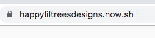
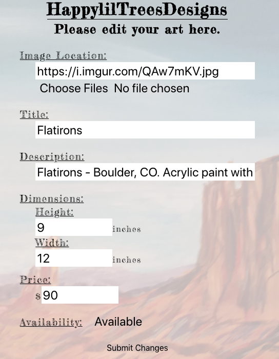
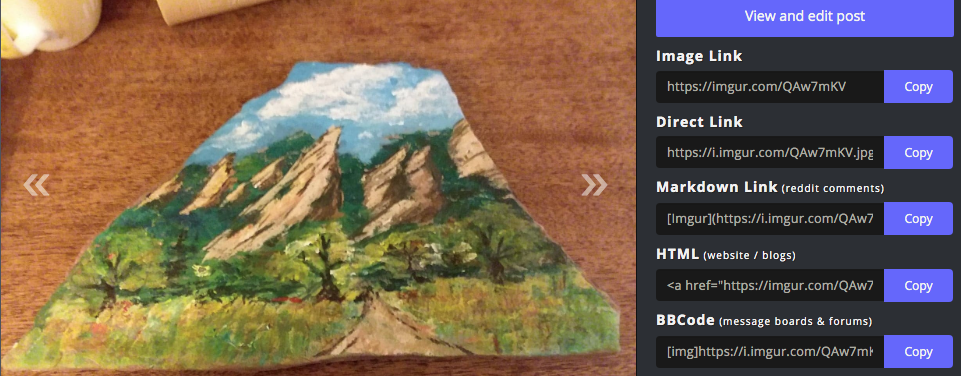

# HappylilTreesDesigns

## To see the app in action, you can visit: [HappylilTreesDesigns](https://happyliltreesdesigns.now.sh)

### API Documentation

GET /art  
Success response object: {  
 status: 200,  
 art: [Array of art objects]  
}  
Failed response object: {  
 status: 400,  
 message: "String"  
}

POST /art  
Request body params: {  
 title: "String",  
 description: "String",  
 price: "Number",  
 height: "Number",  
 width: "Number",  
 image: "String",  
 availability: "String" (available, pending, sold)  
}  
Success response object: {  
 status: 201,  
 art: [New art object]  
}  
Failed response object: {  
 status: 400,  
 message: "String"  
}

PATCH /art/:artid  
Request body params: {  
 title: "String",  
 description: "String",  
 price: "Number",  
 height: "Number",  
 width: "Number",  
 image: "String",  
 availability: "String" (available, pending, sold)  
}  
Success response object: {  
 status: 201,  
 art: [Updated art object]  
}  
Failed response object: {  
 status: 400,  
 message: "String"  
}

DELETE /art/:artid  
Request body params: {  
 none  
}  
Success response object: {  
 status: 200,  
 message: "deleted"  
}  
Failed response object: {  
 status: 400,  
 message: "String"  
}

### Screenshots

Start by navigating to the site:  
  
Sign in as a user that has been created in the database (name: kris, password: lucky). From the main page if you click on an image you are taken to the edit form:  
  
The add new art form starts blank. By selecting a file it is uploaded to imgur and the link is automatically filled out in the form:  
  
When this form is submitted all of the information is saved in a PostgreSQL database.

### Summary

This is a site that I designed and build for a friend to expose and potentially sell her art. While building it I was exposed to great new CSS tricks (layered backgrounds) and XMLHTTPRequests which was very helpful when creating a more responsive progress bar during uploads than FETCH.

### Tech used

Frontend: Javascript, CSS, React.js  
Backend: Node.js, Express, PostgreSQL
